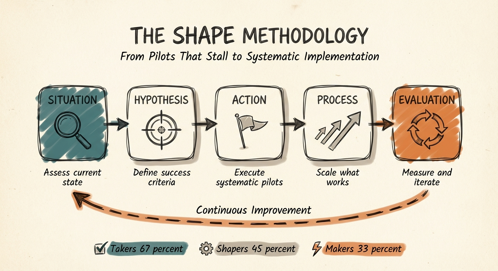

# The SHAPE Methodology

**From Pilots That Stall to Systematic Implementation**

---

Most AI pilots succeed. Most scaled implementations fail.

This isn't a technology problem — it's an execution methodology problem. 95% of AI pilots never achieve enterprise-wide deployment. Organizations lose an average of $1.9 million per failed AI initiative. The pilot-to-scale transition kills more AI projects than technical failure.

The SHAPE Methodology is a five-phase execution framework that bridges the gap between strategy and results:

- **S**ituation — Assess current state honestly before changing anything
- **H**ypothesis — Define measurable success criteria upfront
- **A**ction — Execute systematic pilots with clear decision frameworks
- **P**rocess — Scale what works through systematic phases
- **E**valuation — Measure continuously and iterate based on evidence

## Why SHAPE Exists

Organizations everywhere face the same pattern: A team runs a successful pilot. AI generates promising results. Leadership gets excited. Then someone says "Let's roll this out company-wide."

Six months later, the initiative is quietly shelved. The pilot worked. The scaling didn't.

**The problem isn't strategy.** Most organizations know what they want AI to do.

**The problem is execution methodology.** They lack a systematic approach to move from "this works" to "this works at scale."

## Who This Is For

- **Implementation leaders** who execute AI projects and need systematic methodology for scaling
- **Project managers** moving from pilot success to production deployment
- **Team leads** optimizing workflows without getting lost in tool comparisons
- **Consultants** delivering execution methodology clients can follow independently
- **Anyone** who has strategy but struggles with systematic execution

## Key Concepts

### Takers vs. Shapers vs. Makers

The centerpiece decision framework, backed by research on success rates:

| Approach | Success Rate | Time to Value | When to Use |
|----------|-------------|---------------|-------------|
| **Takers** | 67% | 4-8 weeks | Off-the-shelf vendor solutions. Default choice. |
| **Shapers** | 45% | 8-16 weeks | Customized vendor solutions for industry-specific needs |
| **Makers** | 33% | 16+ weeks | Custom-built solutions for competitive differentiation |

**Default to Takers unless you have compelling, documented reasons for alternatives.** Simple tools that work reliably outperform complex customizations requiring constant maintenance.

### The Adoption Readiness Gate

Technical readiness isn't enough. Before scaling, all six factors must be green:

| Factor | Ready If... |
|--------|-------------|
| Workflow Integration | 3 or fewer steps change for users |
| Interface Accessibility | No IT support required |
| Training Load | Under 4 hours to productive |
| Fallback Plan | Documented manual process exists |
| User Advocacy | Pilot users actively champion expansion |
| Support Scalability | Can handle 5x users without linear headcount |

### The Complexity Creep Audit

Scheduled monthly during scaling. Complexity creeps in one "reasonable" request at a time. If 3+ red flags appear, pause scaling and simplify before continuing.

## Read the Full Guide

The complete methodology with worksheets, templates, examples, and enhancement checklists:

**[The SHAPE Methodology Field Guide](field-guide.md)**

## The PAST + SHAPE Connection

**[PAST](https://github.com/aplaceforallmystuff/past-framework) tells you WHAT and WHY.** Purpose, Audience, Scope, Tone — strategic clarity about what you're trying to achieve.

**SHAPE tells you HOW and WHEN.** Systematic execution from assessment through evaluation.

Together they form a complete system from strategy to implementation.

## Quick-Start: The Hypothesis Test

Before any AI implementation, write your hypothesis in this format:

> "[Specific AI application] will [change named metric] from [baseline number] to [target number] within [timeline]. If [kill criteria], we abandon."

If any element is missing, you have a wish, not a hypothesis. Wishes can't be measured. Hypotheses can.

## License

This work is licensed under a [Creative Commons Attribution-ShareAlike 4.0 International License](https://creativecommons.org/licenses/by-sa/4.0/).

You are free to:
- **Share** — copy and redistribute the material in any medium or format
- **Adapt** — remix, transform, and build upon the material for any purpose, including commercial

Under the following terms:
- **Attribution** — You must give appropriate credit, provide a link to the license, and indicate if changes were made
- **ShareAlike** — If you remix, transform, or build upon the material, you must distribute your contributions under the same license

## Author

Created by [Jim Christian](https://jimchristian.net) — AI implementation specialist, framework creator, and author of [Signal Over Noise](https://signalovernoise.at).

## Contributing

Contributions are welcome. If you've applied SHAPE in your organization and have insights to share, please open an issue or pull request.
